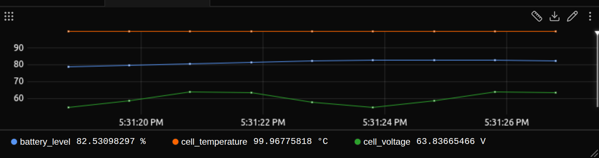

# Zelos

The data platform for hardware systems. Rust, Go and Python SDKs for streaming
your own data in over gRPC.



Docs: https://docs.zeloscloud.io
Site: https://zeloscloud.io

## Repository layout
- `crates/`
  - `zelos` — Meta crate re-exporting top-level APIs
  - `zelos-actions` — Register and serve actions over gRPC
  - `zelos-proto` — Protobuf definitions and generated types
  - `zelos-trace` — Core trace model and logic
  - `zelos-trace-grpc` — gRPC publish/subscribe client
  - `zelos-trace-types` — Shared types
- `crates/zelos/examples/` — Rust examples
- `go/` — Go client, examples, generated stubs
- `python/` — Python examples (zelos-sdk pypi package)

## Quick start

The app or the agent has to be running first. It listens on localhost:2300.
Download the app: https://zeloscloud.io/download
Then install the Python SDK and save this as `stream.py`:

```bash
pip install zelos-sdk
```

```python
import math
import time
import zelos_sdk

# Connect to local agent (auto-reconnects on failure)
zelos_sdk.init()

# Create a source for our power data
source = zelos_sdk.TraceSource("power_monitor")

# Stream at 1 kHz
print("Streaming power data... Press Ctrl+C to stop")
start_time = time.time()

while True:
    t = time.time() - start_time

    # Generate test signals
    voltage = 12.0 + 0.5 * math.sin(2 * math.pi * 50 * t)
    current = 2.0 + 0.2 * math.sin(2 * math.pi * 50 * t + math.pi / 4)

    # Log as a single event (all fields get same timestamp)
    source.log("measurements", {
        "voltage": voltage,
        "current": current,
        "power": voltage * current,
    })

    time.sleep(0.001)  # 1ms = 1kHz
```

Run `python stream.py`. Open the app, go to Signals, and look for `power_monitor/measurements.voltage`, `power_monitor/measurements.current`, and `power_monitor/measurements.power`.

Rust: `cargo add zelos`. Go: `go get github.com/zeloscloud/zelos/go@latest`. The same page has both: https://docs.zeloscloud.io/latest/sdk/quickstart/

To build this repository, use the Nix dev shell below.

## Building this repository
Recommended: use the Nix dev shell. You can also run without Nix if you already have the toolchains.

### Nix + direnv
1) Install Nix and direnv
```bash
# Install Nix
sh <(curl -L https://nixos.org/nix/install) --daemon

# Install direnv
brew install direnv        # macOS
sudo apt-get install direnv -y  # Debian/Ubuntu

# Add to your shell rc (bash example)
echo 'eval "$(direnv hook bash)"' >> ~/.bashrc
source ~/.bashrc
```

2) Enter the dev shell (auto-activated with direnv)
```bash
cd zelos
# First time only
direnv allow
```
This provides Rust, Go, protoc (+ plugins), uv, ruff, treefmt and more.

3) Build and test
```bash
just build
just test
```

## Common commands
Use the top-level `Justfile`.

```bash
# List all recipes
just

# Build, check, lint, test
just build
just check
just clippy
just test

# Formatting
just fmt         # format all supported languages (treefmt)
just fmt-check   # check-only
just fix         # format and fix all
```

### Examples
Ensure a Zelos agent/app is reachable at your URL (default `grpc://127.0.0.1:2300`).

List examples for a language:
```bash
just examples rust
just examples go
just examples python
```

Run one example (optional URL overrides default):
```bash
just example rust hello-world
just example go hello-world
just example python hello-world
# with custom agent URL
just example rust hello-world grpc://127.0.0.1:2300
```

## Actions
Actions let your program expose callable operations to a Zelos agent. Implement the
`Action` trait, register each action under a path in an `ActionsRegistry`, then use
`ActionsClient` to serve them to the agent. Once served, the actions show up on the
agent namespaced by your service name (e.g. `rust-example/add`).

See `crates/zelos/examples/actions.rs` for a runnable example with two actions (`add` and
`check_threshold`):
```bash
just example rust actions
```

The Go SDK exposes the same API (`Action`, `ActionsRegistry`, `ActionsClient`) and,
like the Rust SDK, an ergonomic order-preserving `ActionSchema` builder; see
`go/examples/actions/main.go`:
```bash
just example go actions
```

The advanced examples demonstrate cooperative cancellation: pressing Ctrl-C in the
provider cancels an in-flight action, which logs its cleanup on the way out.
```bash
just example rust actions-advanced
just example go actions-advanced
```

## Protobuf code generation

Regenerate Go stubs (when proto files change):
```bash
just proto-go
```
Outputs go to `go/` from sources in `crates/zelos-proto/proto/`.

## Developing
- Rust workspace: standard Cargo workflow (`just build`, `just test`, `just clippy`).
- Formatting/linting: `just fmt`, `just fmt-check`, `just fix`.
- Python examples run with `uv`
- Go examples run with the system `go`

## License
Licensed under either of:
- Apache License, Version 2.0 — see `LICENSE-APACHE` or https://www.apache.org/licenses/LICENSE-2.0
- MIT license — see `LICENSE-MIT` or https://opensource.org/licenses/MIT

At your option.

